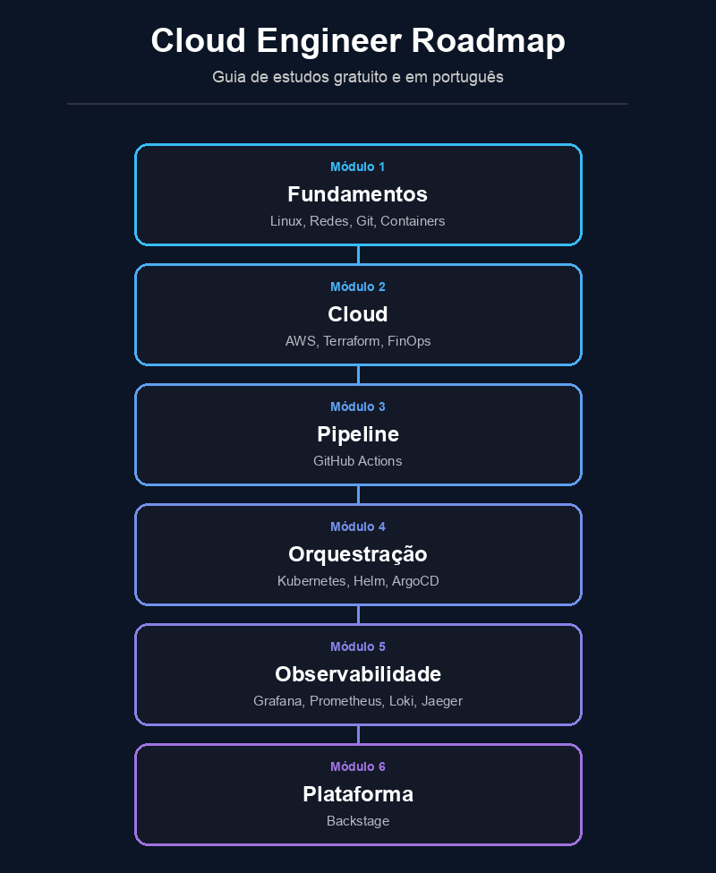

# Cloud Engineer Roadmap

Um guia de estudos **gratuito** e em **português** para quem está começando em Cloud Engineering: a base técnica por trás de disciplinas como DevOps, SRE (Site Reliability Engineering) e Platform Engineering. Com **laboratórios** e **desafios**, você evolui a cada etapa.

## 📍 Acesse o roadmap

O conteúdo completo está no site do projeto: navegável, com barra lateral por módulo e acompanhamento de progresso salvo no seu navegador.

### **➡️ [therenanlira.github.io/cloud-engineer-roadmap](https://therenanlira.github.io/cloud-engineer-roadmap/)**

Este README é só uma vitrine. Todo o conteúdo é escrito e mantido em [`docs/content/`](docs/content/).

## O que você vai encontrar

Uma introdução (cultura DevOps, CNCF, preparação de ambiente) seguida de seis módulos, cada um com trilha de estudo, laboratórios práticos e um desafio para fixar o conteúdo:

1. **Fundamentos**: Linux, Redes, Scripts, Git, Containers
2. **Cloud**: AWS, Terraform, FinOps
3. **Pipeline**: GitHub Actions
4. **Orquestração**: Kubernetes & Helm, ArgoCD
5. **Observabilidade**: Grafana, Prometheus, Loki, Jaeger
6. **Plataforma**: Backstage

## Considerações finais

Se você está começando na área, saiba que a consistência é a sua maior aliada. Não tente aprender tudo de uma vez, vá no seu ritmo. Se necessário, revise e busque outros materiais. Quando menos esperar, você estará dominando ferramentas que antes pareciam muito difíceis.

### Agradecimentos

Um agradecimento especial a todos os profissionais que dedicam seu tempo criando conteúdos gratuitos e compartilhando o conhecimento técnico. Esse projeto só é possível graças aos esforços da comunidade.

> *Não tenho nenhuma afiliação com os criadores sugeridos neste roadmap. Todos os créditos pelos materiais pertencem aos seus respectivos autores que contribuem para a comunidade.*

### Contribuições

Este roadmap é um projeto vivo. Se você encontrou algum erro, quer sugerir um novo treinamento em português ou acredita que algum tópico deve ser adicionado, **sinta-se à vontade para abrir uma Issue ou enviar um *Pull Request***. Vamos fortalecer nossa comunidade!

### Desenvolvimento local

O site (Jekyll) fica em [`docs/`](docs/). Veja [`scripts/README.md`](scripts/README.md) para instruções de como rodá-lo localmente.
