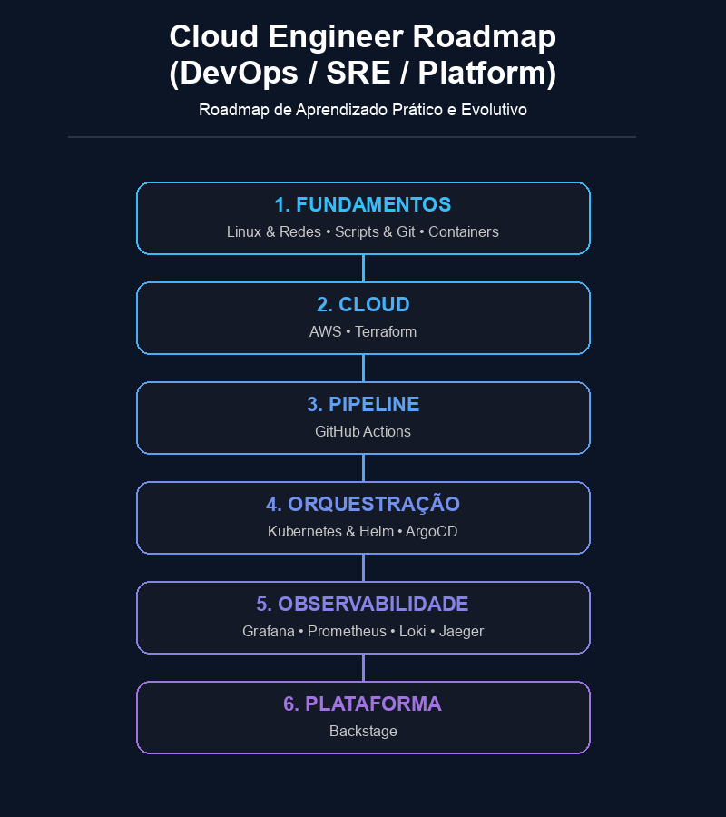

# Cloud Engineer Roadmap (DevOps/SRE/Platform)

Um guia de estudos para iniciantes de Cloud Engineer (DevOps/SRE/Platform) com conteúdos **gratuitos** e em **português**.

Este projeto nasceu com o propósito de ser um **guia prático e acessível para a comunidade brasileira**. Sabendo que o ecossistema de DevOps pode parecer intimidador para iniciantes devido à quantidade de ferramentas complexas, o objetivo é facilitar esse caminho, provando que é possível aprender de forma prática, sequencial e, acima de tudo, gratuita.

Os materiais estão em formatos de vídeos, cursos, documentações, além de **laboratórios** e **desafios**. O objetivo é seguir um caminho de aprendizagem e praticando para evoluir a cada etapa.

Se você está começando na área, saiba que a consistência é a sua maior aliada. Não tente aprender tudo de uma vez, vá no seu ritmo. Se necessário, revise e busque outros materiais. Quando menos esperar, você estará dominando ferramentas que antes pareciam muito difíceis.

> *Eu não tenho ligação com nenhum criador sugerido neste roadmap. Todos os créditos dos materiais pertencem aos seus respectivos autores que contribuem para a comunidade!*

## Navegação Rápida

* [1. Fundamentos](#1-fundamentos)
* [2. Cloud](#2-cloud)
* [3. Pipeline](#3-pipeline)
* [4. Orquestração](#4-orquestração)
* [5. Observabilidade](#5-observabilidade)
* [6. Plataforma](#6-plataforma-platform-engineering)

## Roadmap (Trilha)

O roadmap é dividido em uma sequência de módulos para você evoluir o seu conhecimento.

Clique na imagem para ampliar:

## Introdução

Antes de iniciar a estudar as ferramentas, entenda o que é a cultura DevOps e a CNCF:

### Cultura DevOps

A cultura DevOps une desenvolvimento de software (Dev) e operações (Ops), focando em automação, entrega contínua, testes rápidos e colaboração entre os times.

* [[LinuxTips] DevOps Essentials](https://linuxtips.io/treinamento/devops-essentials/)
* [[LinuxTips] Agile Essentials](https://linuxtips.io/treinamento/agile-essentials/)

### Cloud Native Computing Foundation (CNCF)

A Cloud Native Computing Foundation (CNCF) é uma organização sem fins lucrativos com objetivo de impulsionar e padronizar o desenvolvimento e a adoção de tecnologias open-source (código aberto) voltadas para cloud computing (computação em nuvem).

* **Site oficial:** [Cloud Native Computing Foundation](https://www.cncf.io/)
* **Vídeo explicativo:** [O que é Cloud Native, o LinuxFoundation e a CNCF](https://youtu.be/z2q0gKL9nQg) - Ative a legenda em Português

### Configuração do terminal

A maioria dos ambientes de estudo utiliza distribuições Linux/Unix. Use o Sistema Operacional que preferir e adapte-o para tirar melhor proveito dos treinamentos.

* **Windows:** [Aprenda a usar o WSL no Windows (Diolinux)](https://youtu.be/o1_E4PBl30s)
* **(Opcional) MacOS:** [Altere o Shell padrão no Terminal do Mac](https://support.apple.com/pt-br/guide/terminal/trml113/mac)

> **Dica:** para quem gosta de personalizar o terminal, experimente: [bash-it](https://github.com/bash-it/bash-it) ou [oh-my-zsh](https://github.com/ohmyzsh/ohmyzsh).

### Preparação do Ambiente

Para fazer os laboratórios e desafios, prepare o seu ambiente.

> Caso ainda não tenha familiaridade com o terminal, faça o primeiro treinamento de Linux Fundamentals e depois volte aqui.

1. Acesse [Girus LinuxTips](https://girus.io/#instalacao)
1. Siga os passos de instalação
1. Siga as instruções do terminal

## 1. Fundamentos

A base técnica indispensável: sistemas operacionais, redes, automação e contêineres.

### 1.1. Linux & Redes

Linux é a base de tudo, é o Sistema Operacional mais utilizado em servidores, por conta disso, deve ser aprendido em primeiro lugar.

Redes é a disciplica que trata de como os computadores se comunicam, sendo a base para o funcionamento de sistemas web.

**Trilha de Estudo:**

* **Linux para iniciantes:** [[LinuxTips] Linux Essentials](https://linuxtips.io/treinamento/linux-essentials/)
* **Redes para iniciantes:** Entenda os conceitos dos protocólos de rede e as ferramentas. Guarde bem esse conhecimento, pois serão muito utilizados mais a frente nos laboratórios de Docker em diante.

#### Protocolos de Rede

Esses protocolos são essenciais para a administração de servidores, comunicação entre microsserviços e segurança na nuvem:

* `DNS (Domain Name System)`: É o protocolo usado para traduzir nomes de domínio (como google.com) em endereços IP. Ele permite que os recursos na nuvem se comuniquem por nomes em vez de IPs dinâmicos.
* `SSH (Secure Shell)`: É um protocolo que permite a conexão segura e criptografada a dispositivos e servidores remotos. Essencial para administrar instâncias Linux na nuvem via terminal.
* `TCP / UDP`: Protocolos da camada de transporte. O TCP garante a entrega ordenada e confiável dos dados (usado por HTTP, SSH), enquanto o UDP prioriza a velocidade (usado por DNS).
* `HTTP (Hypertext Transfer Protocol)`: É o protocolo usado para transferir dados na Web. É a base da comunicação de quase todas as APIs modernas e microsserviços.
* `HTTPS (Hypertext Transfer Protocol Secure)`: É uma extensão segura do HTTP que utiliza criptografia SSL/TLS para proteger os dados transmitidos entre o cliente e o servidor.
* `SSL (Secure Sockets Layer) / TLS (Transport Layer Security)`: Protocolos de segurança usados para criptografar conexões na internet. O TLS é o sucessor moderno e seguro do antigo SSL (hoje legado).

#### Ferramentas de Rede

Essas ferramentas são essenciais para testar conexões, mapear portas, configurar firewalls e analisar o tráfego da rede:

* `ping` - Envia pacotes ICMP para testar a conectividade básica com um host na internet.
* `traceroute` / `mtr` - Rastreia a rota feita por pacotes em uma rede IP até o destino, mostrando cada salto (hop). O mtr traz essa análise em tempo real.
* `nmap` - Verifica hosts ativos e faz escaneamento de portas abertas para fins de segurança e descoberta de serviços na rede.
* `ss` / `netstat` - Exibe conexões de rede ativas, tabelas de roteamento e estatísticas de interface diretamente no servidor.
* `dig` - Utilitário essencial para realizar consultas DNS e diagnosticar problemas de resolução de nomes.
* `tcpdump` - Captura e analisa pacotes de dados que trafegam na interface de rede em tempo real (packet sniffer).
* `ufw` / `firewalld` - Interfaces amigáveis para gerenciamento de Firewall no Linux (Ubuntu/Debian e CentOS/RHEL, respectivamente).
* `iptables` e `nftables` - Ferramenta de baixo nível para filtragem de pacotes e regras de firewall do próprio kernel Linux.

> **Dica:** Use os comandos [`man`](guias/man-tldr.md/#-1-o-comando-man-manual-oficial) ou [`tldr`](guias/man-tldr.md/#-2-o-comando-tldr-exemplos-práticos-e-rápidos) para conhecer as flags e ver exemplos de uso de cada ferramenta.

**Laboratórios:**

* Laboratório Girus:
  * Acesse o seu ambiente Girus
  * Vá em Laboratórios
  * Filtre por *Linux*
  * Faça os treinamentos:
    * Processamento de Texto no Linux: grep, sed, awk
    * Monitoramento Básico do Sistema Linux
    * Gerenciamento e Monitoramento de Processos no Linux
    * Administração de Usuários e Grupos no Linux
    * Permissões de Arquivos no Linux

### 1.3. Scripts & Git

Automação e controle de versão do seu código.

#### Scripts (Bash)

Bash é um dos interpretadores de comandos do Linux, com ele conseguimos criar arquivos com comandos (Shell Scripts) para automatizar tarefas repetitivas.

**Laboratórios:**

* Laboratório Girus:
  * Acesse o seu ambiente Girus
  * Vá em Laboratórios
  * Filtre por *Linux*
  * Faça os treinamentos:
    * Introdução ao Shell Script Bash

#### Scripts (Python)

Python é uma das linguagens de programação mais usada em infraestrutura para automações por conta da sua sintaxe simples.

**Trilha de Estudo:**

* **Curso introdutório:** [[Diego Mariano] Introdução à linguagem Python](https://www.udemy.com/course/intro_python/)
* **Maior aprofundamento:** [[LinuxTips] Python Essentials](https://linuxtips.io/treinamento/python-essentials/)

#### Git & GitHub

Git é um sistema de versionamento de código, muito útil para criar versões do seu código e "voltar no tempo" quando alguma alteração não funcionar como esperada.
GitHub é a plataforma de hospedagem de código mais popular, baseada em Git.

**Trilha de Estudo:**

* **GitHub para iniciantes:** [[LinuxTips] GitHub Essentials](https://linuxtips.io/treinamento/github-essentials/)

### 1.4. Containers (Docker)

Contêiner é uma forma de isolar um ambiente para executar códigos, aplicações e asim por diante.
Docker é a ferramenta de criação e execução de contêineres.

**Trilha de Estudo:**

* **Vídeo introdutório:** [[Mayk Brito] Como funciona o Docker? (explicação SIMPLES)](https://youtu.be/IY-ceuwqnns)
* **Docker para iniciantes:** [[LinuxTips] Docker Essentials](https://linuxtips.io/treinamento/docker-essentials/)

**Laboratórios:**

* Laboratório Girus:
  * Acesse o seu ambiente Girus
  * Vá em Laboratórios
  * Filtre por *Docker*
  * Faça os treinamentos:
    * Introdução ao Docker
    * Gerenciamento de Containers Docker
    * Redes no Docker: Conceitos e Implementação
    * Persistência de Dados com Docker Volumes
    * Introdução ao Docker Compose

---

### Checkpoint: Desafio Prático (Fundamentos)

Antes de avançar, aplique o que aprendeu. Este desafio é fundamental para o reforçar o conhecimento.

**Objetivo**: Juntar os seus conhecimentos de Linux, Redes, Scripts e Docker para criar uma página web simples que monitora a conectividade de outros sites.

**Cenário**: Você precisa subir um contêiner Nginx que sirva um arquivo de texto simples contendo o status de conectividade de alguns sites, gerado automaticamente por um script Bash.

**Passo a passo do desafio**:

* **Python:** Crie um script em Python (`monitor.py`) utilizando a biblioteca `requests` para testar os sites. O desafio aqui é entender como gerenciar dependências de bibliotecas externas dentro de um container Docker (usando `pip install`).
* **Processamento de texto:** O script deve salvar o resultado desses testes formatado dentro de um arquivo chamado `status.txt` (ex: `Google: Online`, `SiteFalso: Offline`). Lembre-se de dar as permissões de execução (`chmod +x`) ao seu script.
* **Docker:** Crie um `Dockerfile` utilizando a imagem oficial do `nginx`. O seu Dockerfile deve copiar o arquivo `status.txt` para a pasta padrão que o Nginx usa (`/usr/share/nginx/html`).
* **Redes:** Faça o build da sua imagem (`docker build -t monitor-site .`) e rode o contêiner mapeando a porta `8080` do seu computador para a porta `80` do contêiner (`docker run -p 8080:80 monitor-site`).
* **Validação:** Abra o seu navegador e acesse <http://localhost:8080/status.txt> (ou use o comando `curl localhost:8080/status.txt` no terminal) para ver o relatório de conectividade gerado pelo seu script.
* **Bash**: Crie um único script chamado `deploy.sh` que executa o `monitor.py`, faz o `docker build` e o `docker run` de forma sequencial.

**Solução:** A solução para este desafio está [aqui](desafios/module-01/README.md), mas consulte somente se não conseguir resolver por si só.

> **Aviso de Recursos:** Este laboratório exige recursos locais (CPU/RAM). Certifique-se de encerrar o ambiente após os testes para liberar espaço.

---

## 2. Cloud

Cloud é o conceito de infraestrutura sob demanda, onde você contrata recursos de infraestrutura para executar suas aplicações, banco de dados, entre outros.
IaC (Infrastructure as Code; Infraestrutura como Código) é o conceito de criar esses recursos de infraestrutura em Cloud usando código, assim acelerando a replicação das configurações, padronizando e reduzindo erros humanos.

### 2.1. AWS (Amazon Web Services)

Seu primeiro contato com a nuvem pública. Use a camada gratuita (*Free Tier*) sempre que possível e lembre-se de limpar os recursos para evitar custos.

**Trilha de Estudo:**

* **Treinamento Oficial AWS (Gamificado):** [AWS Cloud Quest: Cloud Practitioner](https://explore.skillbuilder.aws/learn/course/external/view/elearning/11458/aws-cloud-quest-cloud-practitioner) - Com missões práticas onde você usa um console AWS real em um ambiente de laboratório gratuíto, sem precisar usar o seu cartão de crédito.

* **Foco em Certificação (Opcional, pago):** [[Stephane Maarek] Ultimate AWS Certified Cloud Practitioner CLF-C02 2026](https://www.udemy.com/course/aws-certified-cloud-practitioner-new/?couponCode=PMNVD2025) - Se você tiver interesse em tirar uma certificação AWS, o curso do Stephane Maarek é uma excelente sugestão. Esse curso é pago e não é necessário para você seguir o roadmap.

**Laboratórios:**

* Laboratório Girus:
  * Acesse o seu ambiente Girus
  * Vá em Laboratórios
  * Filtre por *Cloud*
  * Faça os treinamentos:
    * AWS S3: Armazenamento de Objetos na Nuvem
    * AWS Lambda: Computação Serverless
    * AWS DynamoDB: Banco de Dados NoSQL

### 2.2. Terraform

Terraform é uma ferramenta de IaC open-source para provisionamento de infraesturura.

**Trilha de Estudo:**

* **Terraform para iniciantes:** [[LinuxTips] Terraform Essentials](https://linuxtips.io/treinamento/terraform-essentials/)

**Laboratórios:**

* Laboratório Girus:
  * Acesse o seu ambiente Girus
  * Vá em Laboratórios
  * Filtre por *Terraform*
  * Faça os treinamentos:
    * Terraform: Fundamentos de Infraestrutura como Código
    * Terraform: Provisioners e Módulos

### 2.3. FinOps (bônus)

Saber provisionar infraestrutura é o básico esperado; saber **quanto ela custa** e como otimizá-la é o que vai te destacar.

* **Alertas (Budgets):** O primeiro passo em qualquer conta cloud é criar um alerta de faturamento para evitar surpresas no cartão.
* **Visibilidade:** Crie o hábito de verificar o *AWS Cost Explorer* para entender como cada serviço (EC2, S3, RDS) impacta a fatura.
* **Arquitetura:** Entenda como os diferentes tipos de arquitetura de processadores (x64, ARM) podem impactar os custos. Entenda como cada serviços do Cloud Provider funciona para escolher o melhor recurso para a sua aplicação (EC2 vs Lambda, por exemplo).
* **Ferramentas da Comunidade:** Procure projetos abertos focados em gestão de custos da AWS, como o [InfraCost](https://github.com/infracost/infracost) e o [Amazon EC2 Instances Comparison](https://instances.vantage.sh).

---

### Checkpoint: Desafio Prático (Cloud)

Antes de avançar, aplique o que aprendeu. Este desafio é fundamental para o reforçar o conhecimento.

**Objetivo**: Juntar os seus conhecimentos de AWS e Terraform e aplicá-los num ambiente controlado (local), sem custos.

**Laboratórios:**

* Laboratório Girus:
  * Acesse o seu ambiente Girus
  * Vá em Laboratórios
  * Filtre por *Cloud*
  * Faça os treinamentos:
    * Terraform com AWS: Construindo Infraestrutura em Nuvem
    * Desafio: AWS com Terraform

> **Aviso de Recursos:** Este laboratório exige recursos locais (CPU/RAM). Certifique-se de encerrar o ambiente após os testes para liberar espaço.

---

## 3. Pipeline

Pipelines são fluxos automatizados de integração (build) e entrega (deploy) contínua, também conhecido como CI/CD (Continuous Integration / Continuou Deployment).

### 3.1. GitHub Actions

GitHub Actions é a ferramenta de CI/CD do GitHub.

**Trilha de Estudo:**

* **Vídeo introdutório:** [[dogcode] Github Actions do Zero e na Prática](https://youtu.be/MIVx1qniNKY)
* **Focado em deploy de Terraform:** [[Fabricio Veronez] Terraform + GitHub Actions: Pipeline do Zero a Produção na Prática](https://youtu.be/SvkW81-Sa9g)
* **Focado em deploy de aplicação:** [[Fernanda Kipper | Dev] Tutorial Pipeline de CI/CD com GitHub Actions | Automatize seus deploys](https://youtu.be/df_WMXk7JxE)

---

### Checkpoint: Desafio Prático (Pipeline)

Antes de avançar, aplique o que aprendeu. Este desafio é fundamental para o reforçar o conhecimento.

**Objetivo:** Criar a sua primeiro pipeline de Integração Contínua (CI) usando GitHub Actions para validar a sua infraestrutura como código (Terraform) e garantir que ela não contenha erros de sintaxe ou formatação.

**Cenário:** Você precisa garantir que ninguém da equipe envie um código Terraform quebrado para o repositório. Para isso, a pipeline deve rodar automaticamente toda vez que houver um `push` na branch `main`.

**Passo a passo do desafio:**

1. Crie um repositório no seu GitHub.
2. Crie um arquivo `main.tf` simples na raiz do repositório contendo apenas a declaração do *provider* da AWS e um recurso básico (como uma VPC).
3. Crie a estrutura de diretórios obrigatória do GitHub Actions: `.github/workflows/`.
4. Dentro dessa pasta, crie um arquivo chamado `ci-terraform.yml`.
5. Escreva um workflow que:
   * Seja acionado em eventos de `push` e `pull_request` para a branch `main`.
   * Faça o *checkout* do seu código.
   * Configure o ambiente do Terraform (**Dica:** pesquise pela *Action* oficial `hashicorp/setup-terraform`).
   * Execute o comando `terraform init`.
   * Execute o comando `terraform fmt -check` (para garantir que o código segue o padrão de estilo).
   * Execute o comando `terraform validate` (para garantir que a sintaxe está correta).
6. Faça o *commit* propositalmente mal formatado para ver o pipeline falhar, corrija-o e veja o pipeline ficar verde (sucesso)!

**Solução:** A solução para este desafio está [aqui](desafios/module-03/README.md), mas consulte somente se não conseguir resolver por si só.

> **Aviso de Recursos:** Este laboratório exige recursos locais (CPU/RAM). Certifique-se de encerrar o ambiente após os testes para liberar espaço.

---

## 4. Orquestração

Orquestração de contêiner é o termo utilizado para o gerenciamento automatizado do ciclo de vida, escalabilidade e resiliência de dezenas ou milhares de contêineres.

### 4.1. Kubernetes & Helm

Kubernetes é a plataforma padrão de mercado para orquestrar microsserviços em contêineres.

**Trilha de Estudo:**

* **Kubernetes para iniciantes:** [[LinuxTips] Kubernetes Essentials](https://linuxtips.io/treinamento/kubernetes-essentials/)
* **Helm - Gerenciador de pacotes para Kubernetes:** [[Fabricio Veronez] Guia Helm: Como simplificar o deploy no Kubernetes](https://youtu.be/VTQpe-ZRgsk)

**Laboratórios:**

* Laboratório Girus:
  * Acesse o seu ambiente Girus
  * Vá em Laboratórios
  * Filtre por *Kubernetes*
  * Faça os treinamentos:
    * Introdução ao Kubernetes-lab
    * Kubernetes: Gerenciando Aplicações com Deployments
    * Serviços e Redes no Kubernetes
    * ConfigMaps e Secrets no Kubernetes
    * Kubernetes: Automatizando Tarefas com CronJobs
    * Desafio: Deployments no Kubernetes
    * Desafio: Explorando Recursos do Kubernetes com kubectl

### 4.2. ArgoCD

ArgoCD é a ferramenta de GitOps mais popular. GitOps é o modelo de implantação contínua baseado no Git como única fonte de verdade. Com esse modelo, as mudanças em infraestrutura, como em Kubernetes, ocorrem via Git.
Por exemplo, mesmo que seja feita uma alteração manual no Kubernetes, o que chamamos de *drift* (desvio de configuração em comparação com o código da infraestrutra), as ferramentas de GitOps forçam a correção.

> Para os estudos e desafios, **não crie um cluster na nuvem** (como EKS). Utilize ferramentas como **Minikube**. Elas rodam um cluster Kubernetes completo localmente na sua máquina, permitindo que você estude e erre de graça.

**Trilha de Estudo:**

* **Vídeo introdutório:** [[LinuxTips] Descomplicando o ArgoCD e o GitOps](https://youtu.be/TDvA2vAQCF8)
* **Maior aprofundamento:** [[Fabricio Veronez] GitOps com ArgoCD na Prática: Do Zero ao Primeiro Deploy](https://youtu.be/NP0tWJh1XoE)

---

### Checkpoint: Desafio Prático (Orquestração)

Antes de avançar, aplique o que aprendeu. Este desafio é fundamental para o reforçar o conhecimento.

**Objetivo**: Juntar os seus conhecimentos de Kubernetes, ArgoCD e GitOps e aplicá-los num ambiente controlado (local), sem custos.

**Cenário**: O Nginx que criamos no Módulo 1 cresceu e agora precisa de alta disponibilidade. A sua missão é usar o **Minikube** (ferramenta usada para criar e testar os desafios) para rodar um cluster local, instalar o **ArgoCD** nele e fazer com que o ArgoCD leia um repositório no GitHub para fazer o deploy automático do seu site Nginx com 3 réplicas!

**Passo a passo do desafio:**

1. Inicie um cluster local usando o **Minikube**.
2. Crie um repositório público no GitHub (ex: `meu-deploy-gitops`).
3. Dentro do repositório, crie os manifestos do Kubernetes: um `deployment.yaml` (usando a imagem `nginx:alpine` com 3 réplicas) e um `service.yaml` (do tipo NodePort).
4. Instale o ArgoCD no seu cluster local seguindo a [documentação oficial](https://argo-cd.readthedocs.io/en/stable/?_gl=1*1qtsrje*_ga*MTU1MTYwMTgyMy4xNzgyMDIxNjA0*_ga_5Z1VTPDL73*czE3ODIwMjE2MDMkbzEkZzAkdDE3ODIwMjE2MDMkajYwJGwwJGgw#quick-start).
5. Descubra a senha padrão do ArgoCD e faça um `port-forward` para acessar o painel dele no seu navegador (localhost).
6. No painel do ArgoCD, crie uma "New App" apontando para o seu repositório do GitHub.
7. Clique em *Sync* e veja que o ArgoCD vai ler os seus arquivos `.yaml` do GitHub e criar os Pods no seu computador!
8. Teste a resiliência criando um "drift" (desvio) ao apagar o Deployment manualmente usando o comando `kubectl delete deployment <nome-do-deployment>` e veja que o ArgoCD irá recriá-lo automaticamente (certifique-se de habilitar as configurações corretas para isso acontecer).

**Solução:** A solução para este desafio está [aqui](desafios/module-04/README.md), mas consulte somente se não conseguir resolver por si só.

> **Aviso de Recursos:** Este laboratório exige recursos locais (CPU/RAM). Certifique-se de encerrar o ambiente após os testes para liberar espaço.

---

## 5. Observabilidade

Observabilidade é a capacidade de entender o estado do sistema (aplicações e infraestrutura), seja por **logs**, **métricas** ou **tracing**.

### 5.1. Grafana (Gráficos)

Grafana é a ferramenta open-source de visualização de gráficos mais popular.

* **Introdução ao Grafana:** [[Estudando DevOps] Introdução ao Grafana | Ferramenta de Observabilidade | Monitoramento](https://youtu.be/RDIax5pDmCc)

### 5.2. Prometheus (Metrics)

Métricas são dados quantitativos (CPU, memória, taxa de erro) que mostram a saúde do seu sistema.
Prometheus é a ferramenta open-source mais usada em Kubernetes.

**Trilha de Estudo:**

* **Aprofundamento em Metrics e AlertManager:** [[Fabricio Veronez] Prometheus + AlertManager no Kubernetes: Monitoramento além do dashboard](https://youtu.be/NTRLWcryaCA)
* **Consultas avançadas no Prometheus::** [[Fabricio Veronez] Guia Prático de PromQL: Aprenda do Zero a Consultar Métricas no Prometheus](https://youtu.be/U8_lQBbQQow)

### 5.3. Logs (Loki)

Logs são registros de eventos que ocorrem em tempo real.
Loki é uma ferramenta open-source de gerenciamento de logs da mesma empresa do Grafana, a GrafanaLabs.

**Trilha de Estudo:**

* **Vídeo introdução com práticas de Grafana Loki:** [[Fabricio Veronez] Logs na Prática: Implementação com Grafana Loki](https://youtu.be/aDKixwnEz-A)

### 5.4. Jaeger (Tracing)

Tracing é uma técnica para rastrear o fluxo das requisições através de múltiplos microsserviços. Essencial em sistemas distribuídos.
Jaeger é uma plataforma open-source de tracing.

**Trilha de Estudo:**

* **Vídeo introdutório:**[[Fabricio Veronez] OpenTelemetry do Zero: Guia Rápido para Devs, SREs e DevOps](https://youtu.be/8JfIeoFoHl0)
* **Maior aprofundamento:** [[Fabricio Veronez] Tracing com OpenTelemetry e Jaeger](https://youtube.com/playlist?list=PLP6PnrFnAWF5xvF4Cyz_0eSStFprk96Ez)

---

### Checkpoint: Desafio Prático (Observabilidade)

Antes de avançar, aplique o que aprendeu. Este desafio é fundamental para o reforçar o conhecimento.

**Objetivo:** Obter visibilidade completa do seu cluster local implementando os três pilares da observabilidade (Metrics, Logs e Tracing) num ambiente controlado (local) e sem custos.

**Passo a passo do desafio:**

1. **Setup:** Suba o seu cluster local e garanta que o [Helm](https://helm.sh/pt/docs/intro/install) esteja instalado no seu ambiente local.
2. **Infraestrutura:** Utilize o Helm para provisionar a "Santíssima Trindade" da Observabilidade:
   * **Métricas:** Prometheus.
   * **Logs:** Loki (com Promtail).
   * **Tracing:** Jaeger (versão `all-in-one`).
   * **Visualização:** Grafana.
3. **Integração:** Configure os *Data Sources* no Grafana para conectar as três fontes de dados em um único painel centralizado.
4. **Instrumentação e Tracing:** Faça o deploy da aplicação de demonstração [Hot R.O.D.](https://github.com/jaegertracing/jaeger/tree/main/examples/hotrod) e utilize comandos efêmeros (`kubectl run`) ou acesse a interface web da aplicação para gerar tráfego de rede e observar os *traces* sendo capturados em tempo real.

**Solução:** A solução para este desafio está [aqui](desafios/module-05/README.md), mas consulte somente se não conseguir resolver por si só.

> **Aviso de Recursos:** Este laboratório exige recursos locais (CPU/RAM). Certifique-se de encerrar o ambiente após os testes para liberar espaço.

---

## 6. Plataforma (Platform Engineering)

A Engenharia de Plataforma é a evolução do DevOps: construindo produtos IDPs (Internal Developer Portals) que oferecem autonomia, autoatendimento e padronização para desenvolvedores, reduzindo a carga cognitiva e acelerando o *time-to-market*.

### 6.1. Backstage

O Backstage, criado pelo Spotify, é o padrão de mercado para IDPs. O Backstage é um framework para centralizar toda a experiência do desenvolvedor, desde a criação de projetos até a visualização de documentação e métricas.

**Trilha de Estudo:**

* **Site Oficial**: [Documentação do Backstage](https://backstage.io/docs/getting-started/)
* **Vídeo introdutório:** [[Iêso Dias] Introdução ao Backstage: O Guia de Engenharia de Plataforma (IDP)](https://youtu.be/zDLUDtFrqoU)

---

### Checkpoint: Desafio Prático (Plataforma)

Antes de avançar, aplique o que aprendeu. Este desafio é fundamental para o reforçar o conhecimento.

#### 1. Instalação do Backstage

Siga os passos de [Instalação do Backstage](desafios/module-06/installation/README.md) para ter a sua própria instância de Backstage localmente. Este guia de instalação é baseado no **guia oficial** [Deploying with Kubernetes](https://backstage.io/docs/deployment/k8s/).

> **Aviso de Recursos:** Este laboratório exige recursos locais (CPU/RAM). Certifique-se de encerrar o ambiente após os testes para liberar espaço.

> **Novidades:** Mais treinametos e desafios para Backstage estão sendo construídos. Fique atento às novidades.

---

## Considerações Finais

### Agradecimentos

Um agradecimento especial a todos os profissionais que dedicam seu tempo criando conteúdos gratuitos e compartilhando o conhecimento técnico. Esse projeto só é possível graças aos esforços da comunidade.

### Contribuições

Este roadmap é um projeto vivo. Se você encontrou algum erro, quer sugerir um novo treinamento em português ou acredita que algum tópico deve ser adicionado, **sinta-se à vontade para abrir uma Issue ou enviar um *Pull Request***. Vamos fortalecer nossa comunidade!

### Sobre o Autor

Este projeto foi organizado por [**Renan Lira**](https://www.linkedin.com/in/therenanlira/).

“A melhor forma de aprender é ensinando e compartilhando conhecimento.”
